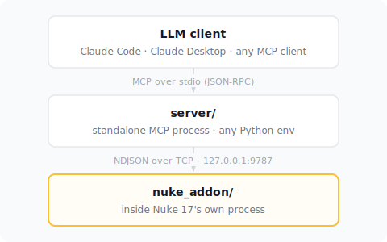

An MCP (Model Context Protocol) server for inspecting and controlling a running [Nuke](https://www.foundry.com/products/nuke-family) 17 session from any MCP-compatible LLM client (Claude Code, Claude Desktop, and in principle others, since MCP is a standard protocol).

## Why two parts

Nuke's Python API is only safe to call from Nuke's own main thread, inside Nuke's own process. An external MCP server process can't `import nuke` and touch a running session directly. So this project is two independently-lifecycled pieces:

- **`nuke_addon/`** — a small addon that runs *inside* Nuke (stdlib-only, no pip dependencies). It opens a `127.0.0.1`-only socket listener in a background thread and bridges each incoming command to Nuke's main thread via `nuke.executeInMainThreadWithResult`.
- **`server/`** — a standalone MCP server process (regular Python, using the official `mcp` SDK). It speaks MCP over stdio to your LLM client on one side, and is a plain socket client to the Nuke addon on the other.

## Setup

See [docs/INSTALL.md](docs/INSTALL.md). `server/` uses [`uv`](https://docs.astral.sh/uv/) — `uv sync` installs everything from the committed lockfile. It is also packaged as a Claude Desktop Extension (`.mcpb`) for one-click installation — build it with `npx @anthropic-ai/mcpb pack server nukemcp.mcpb`. Either way, the Nuke-side addon still needs its own separate `NUKE_PATH` setup.

## Available tools

See [docs/TOOLS.md](docs/TOOLS.md).

## Security model

See [docs/SECURITY.md](docs/SECURITY.md) — short version: loopback-only, no auth handshake, and one tool (`execute_nuke_code`) has full Nuke-API-plus-filesystem reach by design.

## License

[MIT License](LICENSE)
